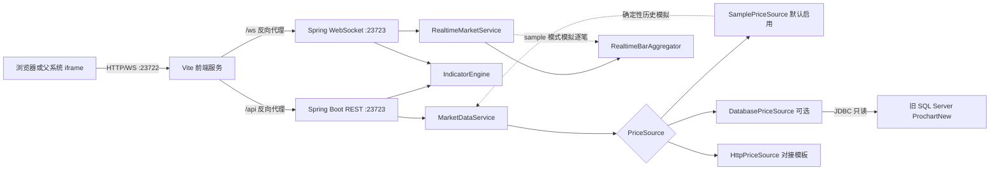
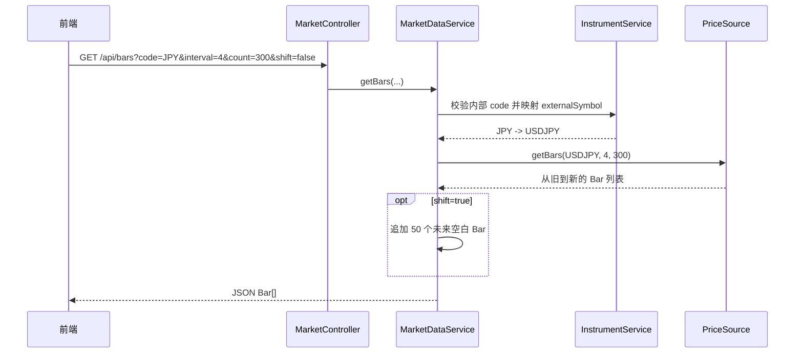
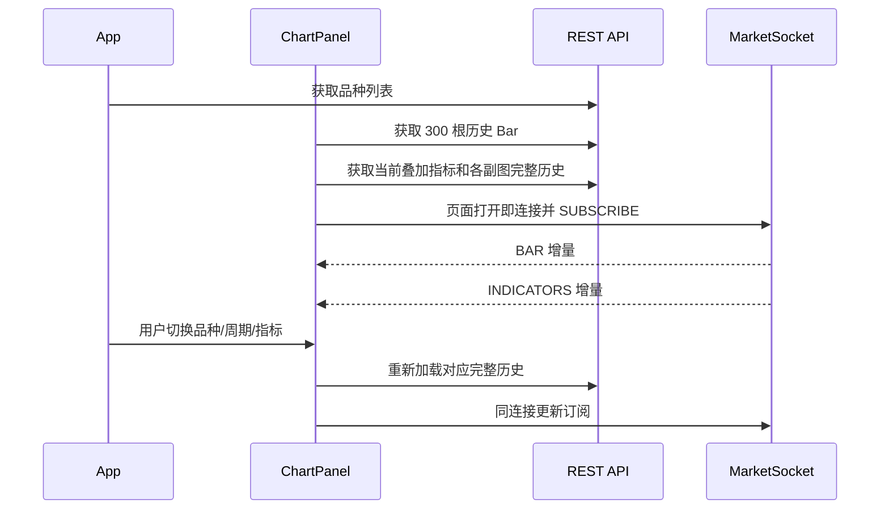

# FOREX_CHART 技术接手手册

> 最后核对：2026-08-06 11:59:50 +08:00  
> 适用范围：新项目 `backend/`、`frontend/` 及固定 Linux 部署包 `offline-packages/FOREX_CHART/`。  
> 旧项目 `chart/` 只作为业务行为和显示效果的参考，不参与新项目启动。  
> 当前状态：默认仍使用模拟行情；已实现旧 SQL Server 的 CU 历史 K 线读取，数据库模式暂不提供实时行情。

## 1. 先看结论

新项目是一个前后端分离的外汇图表系统：

- 前端使用 React、TypeScript 和 Lightweight Charts，负责图表渲染、工具栏、指标副图、绘图工具、手机竖屏和 iframe 交互。
- 后端使用 Spring Boot，负责品种配置、历史 K 线、技术指标计算、支撑阻力以及 WebSocket 实时推送。
- 浏览器只访问前端端口 `23722`；前端服务器将 `/api` 和 `/ws` 代理到同机后端 `127.0.0.1:23723`。
- 页面打开后会自动建立一条 WebSocket；切换品种或周期时，在同一连接中取消旧订阅并订阅新组合。
- sample 模拟实时中的 1 分钟、5 分钟、10 分钟等周期采用相同规则：周期未结束时持续更新最后一根柱，越过自然周期边界后才新增下一根柱。
- “一目均衡图”对应旧项目 Ichimoku，已实现五条线、前移 22 根、绿色网格云层和红蓝交叉信号。
- `prosticks.price-source=database` 时，后端按 11 个周期读取旧库 CU 表，时间按 GMT 周期开始时间解释。
- 模拟实时只允许在 `sample` 模式运行；数据库模式不会把真实历史 K 线与模拟 Tick 混在一起。

常用入口：

| 用途 | 地址或命令 |
|---|---|
| Windows 前端页面 | `http://127.0.0.1:23722/` |
| Linux 外部访问 | `http://Linux服务器IP:23722/` |
| Swagger UI | `http://127.0.0.1:23723/swagger-ui.html` |
| OpenAPI JSON | `http://127.0.0.1:23723/v3/api-docs` |
| 实时 WebSocket | `ws://当前前端主机/ws/market`，HTTPS 页面自动使用 `wss://` |
| Linux 一键重启 | `cd /chart/FOREX_CHART && ./scripts/restart-all.sh` |

## 2. 项目边界与目录

```text
D:\projects\FOREX_CHART\
├─ backend/                         新后端 Spring Boot 工程
│  ├─ pom.xml
│  ├─ src/main/java/com/prosticks/chart/
│  ├─ src/main/resources/application.yml
│  └─ target/forex-chart.jar
├─ frontend/                        新前端 React/Vite 工程
│  ├─ src/
│  ├─ vite.config.ts
│  ├─ package.json
│  └─ dist/
├─ chart/                           旧 ASP/JavaScript 图表，仅供比对
├─ offline-packages/FOREX_CHART/    Linux 固定目录部署包内容
├─ README.md                        项目概览
├─ docs/
│   ├─ changelogs/                   变更日志（按日期归档）
│   ├─ deployment/                   部署文档（Linux 部署、手机本地调试）
│   ├─ requirements/                 需求文档
│   └─ frontend-reading-guide.md     前端代码分阶段阅读路线
└─ TECH.md                          本文档
```

接手时不要混淆三个边界：

1. `chart/` 是旧项目，不能作为新项目的运行依赖。
2. `backend/`、`frontend/` 是日常开发源码。
3. `offline-packages/FOREX_CHART/` 是已经整理好的 Linux 离线部署目录。修改源码后必须重新构建并重新生成部署包，服务器不会自动获得源码变化。

## 3. 总体架构



重要现实边界：

- `PriceSource` 当前只定义“获取历史 K 线”的 `getBars(...)`，没有定义实时逐笔订阅。
- `RealtimeMarketService` 的模拟逐笔没有经过 `PriceSource`，并且现在只允许在 `sample` 模式运行。
- `database` 和 `http` 只替换历史 K 线来源，不会自动获得正式实时行情；WebSocket 仍会保留订阅确认和心跳。

## 4. 后端技术说明

### 4.1 技术栈与启动入口

| 项目 | 当前配置 |
|---|---|
| Spring Boot | 3.2.5 |
| Java 编译级别 | 17 |
| 推荐运行时 | Java 21；最低 Java 17 |
| REST | `spring-boot-starter-web` |
| WebSocket | `spring-boot-starter-websocket` |
| 数据库 | Spring JDBC、HikariCP、Microsoft SQL Server JDBC Driver |
| 参数校验依赖 | `spring-boot-starter-validation`，但控制器当前未系统使用 Bean Validation |
| API 文档 | springdoc OpenAPI 2.3.0 |
| 测试 | JUnit 5 / Spring Boot Test |
| 主类 | `com.prosticks.chart.ChartApplication` |

`ChartApplication` 同时启用：

- Spring Boot 自动配置；
- `@EnableScheduling` 定时任务；
- `PriceSourceProperties` 和 `RealtimeProperties` 配置绑定；database 模式额外绑定 `DatabaseSourceProperties`。

### 4.2 后端包职责

| 包 | 核心类 | 职责 |
|---|---|---|
| `controller` | `MetaController`、`MarketController`、`IndicatorController` | 对外 REST 接口 |
| `service` | `InstrumentService`、`MarketDataService` | 品种校验、代码映射、历史 K 线、支撑阻力 |
| `pricesource` | `PriceSource`、`SamplePriceSource`、`DatabasePriceSource`、`HttpPriceSource` | 历史行情来源抽象及实现 |
| `indicator` | `IndicatorEngine`、`IndicatorKeyResolver` | 24 类指标计算和前端数字 ID 映射 |
| `realtime` | `MarketWebSocketHandler`、`RealtimeMarketService`、`RealtimeBarAggregator` | 订阅、模拟逐笔、K 线聚合、指标增量和心跳 |
| `model` | `Bar`、`Instrument`、`IndicatorResult`、`SupportResist` | REST 和 WebSocket 的共享数据模型 |
| `generator` | `SampleDataGenerator` | 生成可复现的模拟历史数据 |
| `config` | `CorsConfig`、`OpenApiConfig` | REST 跨域和 Swagger 元数据 |

### 4.3 历史 K 线调用链



前端主图实际使用 `shift=false`。只有一目均衡图的指标请求使用 `shift=true`，用于给前移线和未来云层提供时间坐标。

### 4.4 Bar 数据结构

`Bar` 同时兼容普通 OHLCV 和 Prosticks 模态数据：

| 字段 | 类型 | 说明 |
|---|---|---|
| `time` | long | Unix 秒；Lightweight Charts 的主时间字段 |
| `dt` | long | `YYYYMMDDHHMM` 数字格式；模拟历史数据保留旧系统格式 |
| `localtime` | string | 旧系统兼容字段 |
| `o/h/l/c/v` | double | 开、高、低、收、成交量 |
| `mp` | double | Modal Point，模态点/聚焦点 |
| `mc` | int | Modal Count，模态量/聚焦量 |
| `vap/vam` | double | 成交密集区域上沿/下沿 |
| `ut/lt` | double | 上下活跃区阈值/极端尾部阈值 |
| `mclose` | double | `(o+h+l+c)/4` |
| `popen/pclose` | double | Prosticks 衍生值 |
| `impmp` | boolean | 是否为重要模态点 |

旧数据库模式会从日/周/月表读取 `mp/mc/vap/vam`，日表再读取 `ut/lt`；日内周期沿用旧 ASP 输出口径，仅提供 OHLCV。其他只提供 OHLCV 的价源由 `BarBuilder` 将模态字段置为 `0`。

实时新柱当前主要依赖 `time` 和 OHLCV；它的 `dt/localtime` 尚未按真实时间完整回填。前端目前用 `time` 绘图，所以演示不受影响，但正式保存或下游消费前应补齐。

### 4.5 品种配置

品种定义集中在 `backend/src/main/resources/application.yml`：

```yaml
prosticks:
  price-source: sample
  instruments:
    - code: JPY
      name: USD/JPY
      external-symbol: USDJPY
      decimals: 2
      ref-price: 108.5
      annual-vol: 0.08
```

字段含义：

| 字段 | 必需 | 作用 |
|---|---|---|
| `code` | 是 | 系统内部代码，也是 REST/WS 的 `code` |
| `name` | 是 | 工具栏显示名 |
| `external-symbol` | 建议 | 外部报价源代码；未配置时退回 `code` |
| `decimals` | 是 | 前端价格精度和模拟器最小跳动 |
| `ref-price` | sample 使用 | 模拟价格中枢 |
| `annual-vol` | sample 使用 | 模拟波动率 |

当前配置实际有 **35 个**品种。部分旧注释仍写“34 个”，接手时以 YAML 实际条目和 `/api/meta/instruments` 返回为准。

### 4.6 历史价源实现

#### SamplePriceSource

- `prosticks.price-source: sample` 时启用，也是默认值。
- 使用品种和周期生成确定性历史数据，同一输入可复现。
- 历史数据的固定终点是 `2020-05-29 20:59 UTC`；模拟实时行情从该历史末端的下一自然周期继续推进，并不代表当前真实市场时间。
- 不依赖数据库或外部网络，适合开发、演示和回归测试。

#### HttpPriceSource

- `prosticks.price-source: http` 时启用。
- 当前只是通用模板，不是已验证的正式行情适配器。
- 默认识别直接数组，或 `data`、`candles`、`results` 数组。
- 每条数据默认字段为 `t/time`、`o`、`h`、`l`、`c`、`v`；时间支持秒和毫秒。
- API Key 当前通过 URL 查询参数 `apikey` 拼接，没有实现 Header、OAuth、签名或密钥轮换。
- 拉取失败时记录日志并返回空列表，不会把上游错误原样返回给前端。

已知缺口：内部 `10分钟(5)` 和 `2小时(9)` 在 `intervalToApiParam` 中没有显式映射，当前会错误退回 `1day`。正式启用 HTTP 价源前必须按供应商文档补齐全部周期和响应校验。

### 4.7 支撑/阻力

`GET /api/support-resist` 内部读取最近 300 根：

1. 如果超过四分之一的 Bar 有 `mc > 0`，使用模态模式。
2. 模态模式把 `mc` 高于均值的 `mp` 视为重要模态点，最低值为支撑、最高值为阻力。
3. 没有足够模态数据时，退化为最近 60 根有效 Bar 的最低价/最高价。
4. 传统模式下 `latestMP` 实际返回最新收盘价，`averageMC/latestMC` 实际使用成交量。

如果真实价源失败并返回空列表，当前传统算法没有完整的空数据保护。正式接入时应增加明确的上游异常、空数据和 HTTP 状态处理。

### 4.8 指标计算

指标接口用 `pane + type` 消除叠加指标与副图指标的数字 ID 重叠。`params` 是逗号分隔数字；解析失败时不报错，而是回退到默认参数。

叠加指标：

| `type` | 指标 | 默认参数 |
|---:|---|---|
| 0 | 无 | - |
| 1 | SMA | `10,20,50` |
| 2 | Bollinger | `20,2` |
| 3 | EMA | `10,20,50` |
| 4 | SAR | `0.02,0.02,0.2` |
| 5 | Ichimoku / 一目均衡图 | `7,22,44` |
| 6 | WMA | `10,20,50` |
| 7 | MAE | `20,5` |
| 8 | KC | `10` |

副图指标：

| `type` | 指标 | 默认参数 | 当前工具栏可选 |
|---:|---|---|:---:|
| 1 | Volume | - | 是 |
| 2 | RSI | `14` | 是 |
| 3 | MACD | `12,26,9` | 是 |
| 4 | Stochastic | `14,3,3` | 是 |
| 5 | Momentum | `10` | 是 |
| 6 | Williams %R | `10` | 是 |
| 7 | OBV | - | 否 |
| 8 | Modal Count | `300` | 是 |
| 9 | ROC | `14` | 是 |
| 10 | ADX | `14` | 是 |
| 11 | MFI | `14` | 是 |
| 12 | Volatility | `10` | 是 |
| 13 | Volume+ | - | 否 |
| 14 | VAO | `10`，当前算法未实际使用该周期值 | 否 |
| 15 | CCI | `5` | 是 |
| 16 | ATR | `14` | 是 |

后端会返回 RSI、Stochastic、Williams %R、Modal Count、ADX、CCI 等指标的 `levels` 参考水平线；前端当前尚未绘制这些水平线。

只有一目均衡图显式使用 `interval` 决定“日/周/月使用模态值、日内使用 OHLC”。其他价格型指标当前通过数据中 `mp` 的占比推断计算价；模拟数据各周期通常都有 `mp`，因此它们不一定严格遵循旧项目的日内/日线切换口径。若后续要求所有指标逐项与旧系统一致，需要分别核对并改成明确的周期规则。

#### 一目均衡图的旧图对齐规则

- 默认参数固定为 `[7,22,44]`。
- 日、周、月使用模态值；日内周期使用 OHLC/收盘价格逻辑。
- 输出 `Tenkan`、`Kijun`、`Senkou A`、`Senkou B`、`Chikou` 五条序列。
- 按旧项目行为，`Senkou A`、`Senkou B` 和蓝色 `Chikou` 都前移 `22` 根。
- REST 指标请求使用 `shift=true`，后端追加 50 个未来空白时间点。
- 实时计算只为一目均衡图补 22 个未来时间点。
- 前端 `IchimokuPrimitive` 在 `Senkou A/B` 之间绘制浅绿/深绿虚线网格云层，并在 Tenkan/Kijun 交叉处绘制红色向上或蓝色向下信号。
- 实时 `INDICATORS` 消息到达后，五条线和云层会合并最新点并重新绘制。

完整对齐说明见 `docs/changelogs/2026-07-21_ichimoku-alignment.md`。

### 4.9 REST API

所有业务接口都以 `/api` 开头：

| 方法与路径 | 参数 | 返回 |
|---|---|---|
| `GET /api/meta/instruments` | 无 | `Instrument[]` |
| `GET /api/bars` | `code` 必填；`interval=4`；`count=300`；`shift=true` | `Bar[]`，从旧到新 |
| `GET /api/support-resist` | `code` 必填；`interval=4` | `SupportResist` |
| `GET /api/indicators` | `pane`、`type`、`code` 必填；`interval=4`；`params` 可选；`shift=false` | `IndicatorResult` |

示例：

```text
GET http://127.0.0.1:23723/api/bars?code=JPY&interval=4&count=300&shift=false
GET http://127.0.0.1:23723/api/indicators?pane=upper&type=5&code=JPY&interval=0&shift=true
GET http://127.0.0.1:23723/api/indicators?pane=lower&type=3&code=JPY&interval=4&params=12,26,9
```

`IndicatorResult` 结构：

```json
{
  "id": "RSI",
  "name": "RSI",
  "pane": "pane",
  "series": [
    {
      "name": "RSI(14)",
      "color": "#4080FF",
      "data": [{ "time": 1700000000, "value": 51.2 }]
    }
  ],
  "levels": [{ "label": "Overbought", "value": 70, "color": "#FF0000" }]
}
```

当前没有全局异常响应模型。未知品种由 `IllegalArgumentException` 抛出，可能表现为通用 HTTP 500；正式 API 应增加统一异常处理并返回明确的 4xx 错误体。

### 4.10 WebSocket 实时链路

端点：`/ws/market`。

一条浏览器连接在任一时刻维护一个品种/周期订阅，但该订阅可以同时包含一个叠加指标和多个副图指标。服务端按 `MarketKey(code, interval)` 共享行情状态，多个浏览器订阅同一组合时不会重复生成行情。

客户端订阅：

```json
{
  "type": "SUBSCRIBE",
  "code": "JPY",
  "interval": 4,
  "upper": 5,
  "lower": [2, 3]
}
```

客户端还会发送：

```json
{ "type": "UNSUBSCRIBE" }
```

```json
{ "type": "PONG", "serverTime": 1784780000000 }
```

服务端消息：

| `type` | 作用 | 关键字段 |
|---|---|---|
| `SUBSCRIBED` | 确认订阅并告知生效频率 | `code`、`interval`、`config` |
| `BAR` | 更新最后一根或新增一根 K 线 | `code`、`interval`、`bar` |
| `INDICATORS` | 叠加/副图指标增量 | `upper`、`lower[]` |
| `HEARTBEAT` | 服务端心跳 | `serverTime` |
| `ERROR` | 协议或参数错误 | `message` |

`SUBSCRIBED.config` 当前包含：

```json
{
  "tickIntervalMs": 100,
  "barPushIntervalMs": 500,
  "indicatorPushIntervalMs": 1000,
  "heartbeatIntervalMs": 10000
}
```

实时处理规则：

1. 页面建立连接并发送当前 `code/interval/upper/lower`。
2. 服务端首次创建组合状态时读取 300 根历史 K 线，并把历史最后一根视为已完成。
3. 服务端在历史最后时间的下一个自然周期边界创建实时柱。
4. 模拟器每 100ms 产生一次价格；同一周期更新当前柱的高低收和量。
5. 只有发生新逐笔后，BAR 定时任务才会消费一次 dirty 状态；最长每 500ms 推一次，不会无变化重复发送。
6. 越过周期边界才新增柱。因此 5 分钟图的最后一根在这 5 分钟内持续变化，不是等待 300 秒后才第一次显示。
7. 指标最多每 1000ms 重新计算一次；每条序列只推最后一个非空点，避免重复发送整段历史。
8. 每 10 秒发心跳，前端回 `PONG`。

上述频率是最大检查/推送频率，不会凭空制造真实上游报价。如果未来上游 10 秒才来一个 Tick，即使 `bar-push-interval-ms=300`，前端也只会在有新 Tick 后收到变化。

服务端 WebSocket 握手当前允许任意 Origin；这是为了开发代理和 iframe 验证，正式外网环境应收紧到可信父系统域名。

## 5. 前端技术说明

### 5.1 技术栈

| 项目 | 声明版本 | 当前锁定版本 |
|---|---:|---:|
| React | `^18.3.1` | 18.3.1 |
| React DOM | `^18.3.1` | 18.3.1 |
| Lightweight Charts | `^5.0.0` | 5.2.0 |
| Axios | `^1.7.2` | 1.18.1 |
| TypeScript | `^5.5.3` | 5.9.3 |
| Vite | `^5.3.3` | 5.4.21 |

入口是 `src/main.tsx`，使用 React `StrictMode` 渲染 `App`。

### 5.2 前端模块职责

| 文件 | 职责 |
|---|---|
| `src/App.tsx` | 保存品种、周期、图形、指标、工具和语言状态 |
| `src/components/Toolbar.tsx` | 单行工具栏、副图多选、缩放、平移、导出和语言切换 |
| `src/components/ChartPanel.tsx` | 创建图表、请求历史数据、渲染主图/副图、接收实时增量 |
| `src/api/client.ts` | Axios REST 客户端，统一相对路径 `/api` |
| `src/realtime/MarketSocket.ts` | 单 WebSocket、订阅切换、PONG 和指数退避重连 |
| `src/primitives/ProsticksPrimitive.ts` | Prosticks 模态区、尾部和模态点绘制 |
| `src/primitives/IchimokuPrimitive.ts` | 一目均衡图绿色云层和红蓝信号绘制 |
| `src/drawing/DrawingManager.ts` | 趋势线、平行线、斐波那契和文字框 |
| `src/types/index.ts` | 与后端模型及数字常量对应的 TypeScript 类型 |
| `src/i18n/index.ts` | 英文、繁体中文、简体中文 |
| `src/styles/main.css` | 桌面、手机竖屏和 iframe 样式 |

### 5.3 默认状态

| 状态 | 默认值 |
|---|---|
| 品种 | `JPY`，显示 USD/JPY |
| 周期 | `4`，5 分钟 |
| 图表类型 | `4`，蜡烛图 |
| 叠加指标 | `0`，无 |
| 副图指标 | 空数组，可多选 |
| 绘图工具 | `0`，无 |
| 语言 | `sc`，简体中文 |

### 5.4 页面加载和切换流程



前端会过滤与当前 `code/interval` 不匹配的迟到消息，避免切换后旧组合污染新图。

WebSocket 断线后使用 `1、2、4、8……30` 秒指数退避重连；重新打开后自动发送最新订阅。浏览器协议为 HTTPS 时自动选择 `wss:`，否则使用 `ws:`。

### 5.5 图表类型参数

| 值 | 类型 | 说明 |
|---:|---|---|
| 0 | Prosticks | 蜡烛底图 + Prosticks 自定义形态 |
| 2 | Bar | OHLC 柱状图 |
| 3 | Bar & Modal | OHLC 柱状图 + 模态点/活跃区 |
| 4 | Candlesticks | 默认蜡烛图 |
| 5 | Modal Lines | 使用 `mp` 的线图 |
| 6 | Line | 使用收盘价的线图 |
| 7 | Area | 使用收盘价的面积图 |

后端还保留 `TYPE_PROSTICKS_VOL=1` 常量，但前端类型和工具栏没有提供该选项。

### 5.6 周期参数

| 值 | 周期 | 自然桶秒数 |
|---:|---|---:|
| 0 | 日 | 86400 |
| 1 | 周 | 604800 |
| 2 | 月 | 2592000，当前按 30 天处理 |
| 3 | 1 分钟 | 60 |
| 4 | 5 分钟 | 300 |
| 5 | 10 分钟 | 600 |
| 6 | 15 分钟 | 900 |
| 7 | 30 分钟 | 1800 |
| 8 | 1 小时 | 3600 |
| 9 | 2 小时 | 7200 |
| 10 | 4 小时 | 14400 |

当前没有 3 分钟周期。

### 5.7 绘图工具参数

| 值 | 工具 |
|---:|---|
| 0 | 无/工具菜单标题 |
| 1 | 趋势线 |
| 2 | 平行线 |
| 3 | 清除最后一条线 |
| 4 | 清除全部线 |
| 5 | 斐波那契回调 |
| 6 | 斐波那契投射 |
| 7 | 清除斐波那契 |
| 8 | 文字框 |
| 9 | 清除最后一个文字框 |
| 10 | 清除全部文字框 |

绘图对象只保存在当前页面内存，切换品种或刷新页面不会持久化。

### 5.8 手机竖屏和 iframe

断点为 `768px`。当前设计目标是“工具栏尽量一行，选择什么就显示什么，页面可上下滚动查看主图和副图”。

手机/窄 iframe 行为：

- 工具栏不换行，允许横向滑动；控件高度 44px，便于 Android/iPhone 点击。
- 页面自身允许纵向滚动；图表保留横向拖动。
- 图表触摸设置在手机宽度下关闭垂直图表拖动，纵向手势交给页面滚动。
- 主图最低 420px，基础高度为 `max(420px, 62vh/62dvh)`。
- 每选择一个副图，总高度增加 220px；用户向下滚动逐个查看。
- 手机有副图时主图 stretch factor 为 2，副图各为 1。
- 使用 `ResizeObserver` 适配 iframe 区域尺寸变化。
- 使用 `env(safe-area-inset-*)` 适配刘海屏和底部安全区。
- 副图多选菜单在手机上使用 fixed 浮层，最高 `min(70dvh, 480px)`，菜单内部可滚动。

iframe 接入方式：

```html
<iframe
  src="http://Linux服务器IP:23722/"
  title="FOREX Chart"
  style="width:100%;height:700px;border:0"
></iframe>
```

当前没有通过 `postMessage` 向父页面自动上报内容高度。父系统需要自己决定 iframe 占满页面还是占某个区域，并给 iframe 一个实际高度。若父页面同时禁止 iframe 滚动又把高度设得过小，子页面的副图会被裁掉。

### 5.9 前端代理和跨域

`vite.config.ts` 的开发与 preview 配置相同：

```text
0.0.0.0:23722/api/*  -> http://127.0.0.1:23723/api/*
0.0.0.0:23722/ws/*   -> ws://127.0.0.1:23723/ws/*
```

前端代码只使用相对地址，所以浏览器不需要直接访问 `23723`，也不会把服务器本机的 `127.0.0.1` 暴露给浏览器。

REST CORS 当前只允许任意主机的 `23722` HTTP/HTTPS Origin；WebSocket 当前允许任意 Origin。正常通过同源前端代理访问时，不依赖浏览器跨域请求。

### 5.10 Lightweight Charts 归属说明

图表内部已通过 `layout.attributionLogo=false` 隐藏左下角 TradingView attribution Logo。依赖许可证要求的归属说明仍应放在外层系统“关于”或“法律声明”页面。不要把隐藏 Logo 等同于免除许可证义务。

## 6. 后端配置参数

主配置文件：`backend/src/main/resources/application.yml`。

| 参数 | 当前值 | 说明 |
|---|---:|---|
| `server.address` | `127.0.0.1` | 后端仅允许同机访问 |
| `server.port` | `23723` | 后端端口 |
| `prosticks.price-source` | `${PROSTICKS_PRICE_SOURCE:sample}` | `sample`、`database` 或 `http` |
| `prosticks.realtime.enabled` | `${PROSTICKS_REALTIME_ENABLED:true}` | 是否允许模拟 Tick；只有 `sample` 模式实际启用 |
| `prosticks.realtime.tick-interval-ms` | `100` | 模拟器尝试生成 Tick 的间隔 |
| `prosticks.realtime.bar-push-interval-ms` | `500` | dirty Bar 的最大发送频率 |
| `prosticks.realtime.indicator-push-interval-ms` | `1000` | 指标增量计算/发送频率 |
| `prosticks.realtime.heartbeat-interval-ms` | `10000` | 心跳频率 |
| `prosticks.realtime.history-count` | `300` | 每个实时组合内存中保留的 Bar 数 |
| `prosticks.http.base-url` | 空 | HTTP 价源根地址 |
| `prosticks.http.api-key` | 空 | 当前模板的查询参数密钥 |
| `prosticks.http.bars-path` | `/candles/{symbol}?interval={interval}&count={count}` | 历史 K 线路径模板 |
| `prosticks.database.jdbc-url` | `${FOREX_DB_URL:}` | SQL Server JDBC URL，database 模式必填 |
| `prosticks.database.username` | `${FOREX_DB_USERNAME:}` | 旧库只读账号，database 模式必填 |
| `prosticks.database.password` | `${FOREX_DB_PASSWORD:}` | 只从环境变量注入，禁止提交真实密码 |
| `prosticks.database.maximum-pool-size` | `5` | 旧库连接池最大连接数 |
| `prosticks.database.connection-timeout-ms` | `10000` | 取得数据库连接的最长等待时间 |
| `prosticks.database.query-timeout-seconds` | `15` | 单次历史查询超时 |

定时任务使用 `fixedDelay`。例如把 Bar 推送改为 300ms：

```yaml
prosticks:
  realtime:
    bar-push-interval-ms: 300
```

修改后必须重启后端。前端无须同步写死该值，订阅确认消息会返回服务端生效配置。

## 7. Windows 开发、构建与运行

### 7.1 环境

- Java 17 或更高；当前已使用 Java 21 验证。
- Maven 3.9.x。
- Node.js 和 npm。当前 Windows 环境为 Node.js v24.13.0、npm 11.6.2；项目部署包使用兼容 RHEL 7.5 的 Node.js v22.23.1。

### 7.2 启动后端源码

```powershell
Set-Location D:\projects\FOREX_CHART\backend
mvn spring-boot:run
```

### 7.3 构建并启动后端 JAR

```powershell
Set-Location D:\projects\FOREX_CHART\backend
mvn clean package
java -jar .\target\forex-chart.jar
```

如果 JAR 已经存在，可直接执行第二条命令。指定某个 Java 21：

```powershell
& 'D:\Java\jdk21\bin\java.exe' -jar 'D:\projects\FOREX_CHART\backend\target\forex-chart.jar'
```

使用旧数据库历史价源时，在当前 PowerShell 会话中先设置环境变量：

```powershell
$env:PROSTICKS_PRICE_SOURCE = 'database'
$env:PROSTICKS_REALTIME_ENABLED = 'false'
$env:FOREX_DB_URL = 'jdbc:sqlserver://数据库主机:1433;databaseName=ProchartNew;encrypt=true;trustServerCertificate=true'
$env:FOREX_DB_USERNAME = '只读账号'
$env:FOREX_DB_PASSWORD = '密码'
java -jar .\target\forex-chart.jar
```

`trustServerCertificate=true` 只适用于当前内网证书尚未纳入 Java 信任库的情况；具备正式受信证书后应删除该参数或改为 `false`。真实账号密码不得写入 `application.yml`、启动脚本或本文档。

临时覆盖端口：

```powershell
java -jar .\target\forex-chart.jar --server.port=23723 --server.address=127.0.0.1
```

### 7.4 启动前端开发服务

```powershell
Set-Location D:\projects\FOREX_CHART\frontend
npm install
npm run dev
```

访问 `http://127.0.0.1:23722/`。

### 7.5 构建和预览前端

```powershell
Set-Location D:\projects\FOREX_CHART\frontend
npm run build
npm run preview
```

改变端口时至少同步检查：

1. `backend/src/main/resources/application.yml` 的后端监听地址和端口；
2. `frontend/vite.config.ts` 的 `server.port`、`preview.port`、`/api target` 和 `/ws target`；
3. `backend/.../CorsConfig.java` 的允许前端端口；
4. Linux 启停和状态脚本中的 `23722/23723`；
5. 防火墙、安全组和 iframe URL。

## 8. Linux 固定目录部署

### 8.1 固定路径

```text
应用目录：/chart/FOREX_CHART/
部署包：  /chart/FOREX_CHART.tar.gz
校验文件：/chart/FOREX_CHART.tar.gz.sha256
外部 JDK：/chart/openlogic-openjdk-21.0.11+10-linux-x64/
```

JDK 独立放在 `/chart/`，替换整个应用目录不会删除 JDK。

目标环境是 RHEL 7.5 x86_64、glibc 2.17。部署包内含兼容该环境的 Node.js v22.23.1 离线运行时、前端 Linux 依赖、前端 `dist` 和后端 JAR。

### 8.2 全新部署

```bash
cd /chart
sha256sum -c FOREX_CHART.tar.gz.sha256
tar -xzf FOREX_CHART.tar.gz
cd /chart/FOREX_CHART
chmod +x scripts/*.sh
./scripts/check-environment.sh
sha256sum -c MANIFEST.sha256
./scripts/start-all.sh
```

外部只需开放 TCP `23722`。不要开放只监听本机的 `23723`。

### 8.3 日常命令

```bash
cd /chart/FOREX_CHART
./scripts/status.sh
./scripts/restart-all.sh
./scripts/stop-all.sh
./scripts/start-all.sh
```

日志：

```bash
tail -f /chart/FOREX_CHART/run/backend.log
tail -f /chart/FOREX_CHART/run/frontend.log
```

`start-backend.sh` 最多等待 30 秒确认 `23723` 监听，`start-frontend.sh` 最多等待 20 秒确认 `23722` 监听。Java 进程存在但端口尚未监听时，等待期间的 `status.sh` 可能暂时显示“进程运行中、端口未监听”。

### 8.4 上传完整新包后的替换流程

```bash
cd /chart/FOREX_CHART
./scripts/stop-all.sh

cd /chart
BACKUP_DIR="FOREX_CHART.backup.$(date +%Y%m%d%H%M%S)"
mv FOREX_CHART "${BACKUP_DIR}"
tar -xzf FOREX_CHART.tar.gz
chmod +x FOREX_CHART/scripts/*.sh
FOREX_CHART/scripts/check-environment.sh
cd FOREX_CHART
sha256sum -c MANIFEST.sha256
./scripts/start-all.sh
```

验证新版本正常后再删除备份目录。启动失败时，可以移走新目录并把备份目录改回 `FOREX_CHART`。

### 8.5 当前 Linux 前端服务定位

当前使用 `vite preview` 是为了在无 Nginx 的服务器上快速看效果和验证 WebSocket，不是面向高并发、TLS、缓存和安全加固的长期生产 Web Server。正式发布建议在后续引入 Nginx、Apache 或企业网关，并继续保持 `/api`、`/ws` 同源代理。

## 9. 测试与当前验证状态

2026-08-06 11:35 本次旧数据库历史价源开发后执行：

```text
backend: mvn test
结果：14 tests，0 failures，0 errors，BUILD SUCCESS

backend: mvn clean package
结果：BUILD SUCCESS，生成 target/forex-chart.jar

backend: sample 模式随机端口启动并请求 /api/meta/instruments、/api/bars
结果：35 个品种，3 根 JPY/5分钟 Bar，时间从旧到新，HTTP 正常

frontend: npm exec tsc -- --project tsconfig.json --noEmit --pretty false
结果：通过，无 TypeScript 错误
```

后端测试当前覆盖：

- 一目均衡图旧项目 22 根前移和日内 OHLC 计算；
- 5 分钟同周期更新最后柱和跨周期新增柱；
- 有 Tick 才产生 dirty Bar，消费后不重复推送；
- 指标实时消息只保留各序列最后有效点。
- CU 11 个周期到旧表的白名单映射和参数占位符；
- 旧库 GMT 周期开始时间、OHLCV/模态字段到 `Bar` 的转换；
- 查询结果从数据库“新到旧”反转为 API“旧到新”；
- database 历史模式不会创建模拟实时柱。

尚未形成自动化覆盖的重点：

- Controller REST 集成测试和统一错误响应；
- WebSocket 订阅协议的 Java 端到端测试；
- 前端组件/浏览器自动化测试；
- 真机 Android/iPhone 兼容矩阵；
- 真实价源断线、乱序、重复 Tick、延迟和补数场景；
- Linux 部署包在每次源码修改后的自动重建校验。

## 10. 正式报价源接入方案

正式数据源应拆成“历史”和“实时”两条链路，不要误以为一个 HTTP 历史接口就能让最后一根柱实时跳动。

### 10.1 历史链路

当前支持：

1. `SamplePriceSource`：默认模拟历史数据；
2. `DatabasePriceSource`：已实现旧 SQL Server 的 CU 历史数据；
3. `HttpPriceSource`：仍是供应商 HTTP 接口模板，尚未正式对接。

未来直接接供应商时应新增供应商专用 `XxxPriceSource`，不要把大量供应商分支堆入通用模板。

输出必须满足：

- Bar 按 `time` 从旧到新排序；
- 时间统一为 Unix 秒；
- OHLC 价格合法，`high >= open/close/low`，`low <= open/close/high`；
- 重复时间去重；
- 明确未完成历史柱是否返回；
- 供应商代码通过 `external-symbol` 映射，不把外部代码散落在业务层。

### 10.2 实时链路

当前项目还没有实时价源接口。建议增加一个职责单一的实时输入抽象，例如：

```text
RealtimeTickSource
  subscribe(externalSymbol, onTick)
  unsubscribe(externalSymbol)
  connectionStatus()

Tick
  symbol
  eventTimeSeconds
  price
  volume
  sequenceId（如果供应商提供）
```

然后把真实 Tick 送入现有 `RealtimeBarAggregator`，继续复用当前的周期桶、BAR 节流、指标计算和浏览器订阅协议。需要新增：

- 上游连接管理、鉴权和自动重连；
- 外部 symbol 到内部 code 的反向映射；
- Tick 去重、乱序容忍和迟到策略；
- 交易时段、周末和市场关闭处理；
- 断线补数以及历史/实时接缝；
- 多实例部署时的共享行情总线或固定路由；
- 监控：最后 Tick 时间、重连次数、订阅数、推送延迟和丢弃数。

浏览器侧协议可以保持不变，所以真正的改造重点在后端上游，不需要为每个供应商重写前端。

### 10.3 Prosticks 专属字段

旧数据库第一阶段的已确认结论见第 15 节。未来直接对接供应商或扩大业务范围时，仍必须向数据提供方确认：

- `mp/mc/vap/vam/ut/lt` 是行情源直接提供、数据库预计算，还是后端二次计算；
- 日/周/月和日内数据的聚合口径；
- 旧系统使用的表、存储过程、批处理以及更新频率；
- 历史修订、缺口回补和时区；
- `impmp/popen/pclose/mclose` 的权威计算规则。

如果拿不到这些规则，新系统只能保证普通 OHLCV 图表和传统指标，不应宣称 Prosticks 模态结果与旧生产系统完全一致。

## 11. 已知限制与上线前检查

| 级别 | 当前限制 | 影响/处理建议 |
|---|---|---|
| 高 | 数据库模式尚未用生产连接完成联调 | 代码、字段和 SQL 契约已测试；上线前逐周期核对生产查询结果 |
| 高 | 数据库模式只有历史 K 线，没有实时更新 | 当前不会生成假实时柱；后续需增加旧库轮询或正式实时输入 |
| 高 | 无鉴权，WebSocket Origin 为 `*` | 外网正式部署前接入认证、授权和可信 Origin |
| 高 | `HttpPriceSource` 缺 10 分钟、2 小时映射 | 正式启用前按供应商文档补齐并测试 |
| 中 | HTTP 拉取失败返回空列表 | 增加重试、熔断、明确错误响应和空数据保护 |
| 中 | `database` 依赖旧库可用性且没有缓存 | 旧库不可达时历史接口失败；需要运维监控连接和查询耗时 |
| 中 | Vite preview 不是正式生产服务器 | 效果验证可用，正式发布引入网关/Web Server |
| 中 | 前端未绘制指标 `levels` | RSI 等参考线暂不显示，需要专门实现 |
| 低 | 后端支持 OBV、Volume+、VAO，但工具栏未列出 | 如业务需要，在 `LOWER_OPTIONS` 增加选项 |
| 低 | 除 Ichimoku 外的价格型指标按 `mp` 占比推断计算价 | 要求旧图严格一致时，逐项改成明确的周期口径 |
| 低 | 部分注释写 34 个品种，实际是 35 个 | 以 YAML 和接口返回为准，后续清理旧注释 |
| 低 | TypeScript `Instrument` 未声明 `externalSymbol` | JSON 多余字段不会影响运行；使用该字段前补类型 |
| 低 | 月周期按固定 30 天聚合 | 如需自然月，改为日历时区边界 |

## 12. 常见排障

### 12.1 页面打不开

Linux：

```bash
cd /chart/FOREX_CHART
./scripts/status.sh
ss -lntp | grep -E ':(23722|23723)[[:space:]]'
tail -n 100 run/frontend.log
tail -n 100 run/backend.log
```

外部只访问 `http://服务器IP:23722/`，不是 `23723`。

### 12.2 页面能开，但 API 500

依次确认：

1. `23723` 已真正监听；
2. `curl http://127.0.0.1:23723/api/meta/instruments`；
3. `curl http://127.0.0.1:23722/api/meta/instruments`；
4. 查看 `run/backend.log` 和 `run/frontend.log`；
5. 确认 JAR 与前端包来自同一版本。

### 12.3 图表不跳动

- 浏览器开发者工具 Network 中检查 `/ws/market` 是否为 `101 Switching Protocols`。
- 检查是否持续收到 `HEARTBEAT`、`BAR`。
- 确认 Vite `/ws` 代理仍指向 `ws://127.0.0.1:23723`。
- 只有 `sample` 模式提供模拟跳动；`database` 第一阶段只有历史，看到心跳但没有 `BAR` 属于预期行为。
- sample 模式再确认 `prosticks.realtime.enabled=true`。
- 如果已经改成真实上游，确认最后 Tick 时间，而不是只看 500ms 定时参数。

### 12.4 一目均衡图有线但没有云层

- 工具栏叠加指标必须选择 `type=5`。
- REST 请求必须使用 `shift=true`，否则未来时间坐标不足。
- 响应中必须同时有同一时间的 `Senkou A` 和 `Senkou B` 非空点。
- 检查 `IchimokuPrimitive` 是否已附加到主序列。
- 切换图表类型后会重建主序列，随后应重新加载叠加指标。

### 12.5 手机副图被裁掉

- 父页面必须给 iframe 实际高度。
- 不要同时设置过小高度和 `scrolling=no`。
- 子页面会按每个副图增加 220px，并依靠 iframe 内纵向滚动查看。
- 检查父页面是否对 iframe 容器使用了 `overflow:hidden`。

### 12.6 端口占用

Windows：

```powershell
Get-NetTCPConnection -State Listen -LocalPort 23722,23723 |
  Select-Object LocalAddress,LocalPort,OwningProcess
```

Linux：

```bash
ss -lntp | grep -E ':(23722|23723)[[:space:]]'
```

优先使用项目启停脚本停止由 PID 文件记录的进程，不要只按模糊进程名批量杀进程。

## 13. 建议阅读顺序

新接手人员可按以下顺序阅读：

1. 本文档第 1～3 节，理解边界和总架构。
2. `backend/src/main/resources/application.yml`，确认端口、价源、实时频率和品种。
3. `backend/.../controller` 和 `frontend/src/api/client.ts`，理解 REST 契约。
4. `MarketWebSocketHandler.java` 和 `MarketSocket.ts`，理解实时协议。
5. `MarketDataService.java`、`RealtimeMarketService.java`、`RealtimeBarAggregator.java`，理解历史与实时接缝。
6. `IndicatorEngine.java`、`ChartPanel.tsx` 和两个 primitive，理解指标与绘图。
7. `docs/deployment/2026-07-22_linux-deployment.md`，理解服务器发布流程。
8. 使用旧数据库时阅读第 15 节；准备接正式报价源时再读第 10～11 节。

## 14. 文档维护规则

涉及以下变化时应同步更新本文件：

- 新增或修改 REST/WS 消息字段；
- 改端口、代理、部署目录、JDK 或 Node 版本；
- 新增周期、品种、图表类型、指标或绘图工具；
- 切换历史/实时价源；
- 改变 iframe 高度、滚动或手机断点；
- 修复“已知限制”中的项目；
- 重新生成 Linux 完整部署包。

本文件描述的是当前代码事实。旧项目行为、业务口径和正式数据源规则如果尚未得到负责人确认，应继续标记为待确认，不能凭推测写成生产规则。

## 15. 旧数据库 CU 历史接入记录

### 15.1 2026-08-06 已确认边界

- 新系统只读取旧数据库，不负责 eSignal 写库。
- 第一阶段只处理 CU 外汇和贵金属；IX 指数不在本阶段范围。
- `tbl10MinCU` 在生产库存在，字段按其他分钟表的 `MinOpen/MinHigh/MinLow/MinClose/MinVolume` 处理。
- CU 时间字段是 GMT，表示每根 K 线的周期开始时间。
- 旧程序持续维护旧库数据；本阶段只读取已完成的历史 K 线，不做数据库轮询和实时推送。
- 使用既有只读账号，不修改旧表、不增加表、不执行写操作。

### 15.2 周期、表和字段映射

| 新系统 interval | 周期 | 旧表 | 时间字段 | OHLCV 字段 |
|---:|---|---|---|---|
| 0 | 日 | `tblDayCU` | `DateTime` | `DayOpen/DayHigh/DayLow/DayClose/DayVolume` |
| 1 | 周 | `tblWeekCU` | `Week` | `WeekOpen/WeekHigh/WeekLow/WeekClose/WeekVolume` |
| 2 | 月 | `tblMonthCU` | `Month` | `MonthOpen/MonthHigh/MonthLow/MonthClose/MonthVolume` |
| 3 | 1 分钟 | `tblMinCU` | `DateTime` | `MinOpen/MinHigh/MinLow/MinClose/MinVolume` |
| 4 | 5 分钟 | `tbl5MinCU` | `DateTime` | `MinOpen/MinHigh/MinLow/MinClose/MinVolume` |
| 5 | 10 分钟 | `tbl10MinCU` | `DateTime` | `MinOpen/MinHigh/MinLow/MinClose/MinVolume` |
| 6 | 15 分钟 | `tbl15MinCU` | `DateTime` | `MinOpen/MinHigh/MinLow/MinClose/MinVolume` |
| 7 | 30 分钟 | `tbl30MinCU` | `DateTime` | `MinOpen/MinHigh/MinLow/MinClose/MinVolume` |
| 8 | 1 小时 | `tblHourCU` | `DateTime` | `HourOpen/HourHigh/HourLow/HourClose/HourVolume` |
| 9 | 2 小时 | `tbl2HourCU` | `DateTime` | `HourOpen/HourHigh/HourLow/HourClose/HourVolume` |
| 10 | 4 小时 | `tbl4HourCU` | `DateTime` | `Open/High/Low/Close/Volume` |

模态字段口径：

- 日线：`VAPlus -> vap`、`VAMinus -> vam`、`MP -> mp`、`MC -> mc`、`UpperTail -> ut`、`LowerTail -> lt`。
- 周线：`WeekVAPlus -> vap`、`WeekVAMinus -> vam`、`WeekMP -> mp`、`WeekMC -> mc`，`ut/lt=0`。
- 月线：`VAPlus -> vap`、`VAMinus -> vam`、`MP -> mp`、`MC -> mc`，`ut/lt=0`。
- 日内：沿用旧 `chart/data/datajson.asp` 的输出行为，只读取 OHLCV，模态字段统一为 `0`。虽然 `tbl4HourCU` 结构中存在模态列，第一阶段也不额外启用。

### 15.3 查询和输出规则

1. 表名和字段名全部来自 `LegacyCuQuerySpec` 固定白名单，外部参数不能指定表名或列名。
2. 每次使用 `Code` 和数量参数查询：SQL Server `TOP (?)`，按时间字段倒序获取最近数据。
3. `Code` 使用 JDBC 参数绑定；默认取前端要求的 300 根，数据库价源最大限制为 1000 根。
4. 查询结果在后端反转，REST 始终返回“最旧到最新”，符合 `PriceSource` 契约和 Lightweight Charts 要求。
5. 旧库无时区的 `smalldatetime` 按 GMT 周期开始时间转成 Unix 秒；`dt/localtime` 保留旧格式 `YYYYMMDDHHMM`。
6. `mclose/pclose` 由 `Bar` 统一计算；`popen` 按最旧到最新递推；日/周/月使用旧图 `mc>=8` 的均值口径标记 `impmp`。
7. 查询失败会记录 `code/interval/table` 并让接口明确失败，不输出 JDBC URL、账号或密码。

### 15.4 启动与联调

Linux 可在启动前设置以下环境变量；如果通过服务管理器启动，应把变量放到受权限保护的服务环境文件中：

```bash
export PROSTICKS_PRICE_SOURCE=database
export PROSTICKS_REALTIME_ENABLED=false
export FOREX_DB_URL='jdbc:sqlserver://数据库主机:1433;databaseName=ProchartNew;encrypt=true;trustServerCertificate=true'
export FOREX_DB_USERNAME='只读账号'
export FOREX_DB_PASSWORD='密码'
cd /chart/FOREX_CHART
./scripts/restart-all.sh
```

实际数据库可访问后，先验证一个品种的全部 11 个周期：

```powershell
0..10 | ForEach-Object {
  $url = "http://127.0.0.1:23723/api/bars?code=JPY&interval=$_&count=3&shift=false"
  $bars = Invoke-RestMethod $url
  "interval=$_ count=$($bars.Count) first=$($bars[0].dt) last=$($bars[-1].dt)"
}
```

联调验收时必须确认：每个周期返回数据、时间严格递增、最新时间与 DBeaver 查询一致、OHLCV 一致，以及日/周/月模态字段一致。当前本地没有使用生产账号执行上述数据库联调，因此不能把单元测试通过等同于生产数据库验收。

### 15.5 固定后端 JAR 名称

2026-08-06 11:55:28 确认后端 Maven 构建产物固定为 `backend/target/forex-chart.jar`。Windows 启动命令、Linux 启停脚本、环境检查、离线部署包和校验清单必须统一使用该名称；`artifactId=chart-backend` 与 `spring.application.name=prosticks-chart-backend` 仍保留，因为它们分别是 Maven 坐标和应用标识，不是部署文件名。

2026-08-06 11:59:50 已重新执行 `mvn clean package`，14 个测试全部通过，并用 `java -jar target/forex-chart.jar` 完成 REST 启动冒烟。`FOREX_CHART` 与历史部署包副本的 JAR、内部清单、压缩包和外层 SHA-256 均已同步；当前 Windows 没有可用的 Linux Bash 环境，因此未执行 `bash -n`，本次脚本只改动固定文件名和注释。

### 15.6 2026-08-24 空表补数与生产库联调验收

**盘点结论 (2026-08-24 12:15)**：生产库 11 张 CU 表中 `tblMinCU`、`tbl10MinCU`、`tbl15MinCU`、`tbl4HourCU` 全空，`tblHourCU` 仅有 2 行 2026-06-01 的测试残留 (AUD/EUR, Volume=0)；其余 6 张有真实数据，最新到 2026-07-10 20:55 (周五收盘)。全部 35 个品种代码 (yml 实际为 35 个，README 写 34 个是文档误差) 在 `tbl5MinCU` 中均有完整数据。

**补数口径 (已获负责人 2026-08-24 授权，推翻 15.1 的"不写库"边界，仅限本节范围)**：

1. 10 分 / 15 分 / 1 小时 / 4 小时：在服务端直接从 `tbl5MinCU` 聚合，每品种取最近 1000 根。聚合规则 (首根 Open、末根 Close、High 取 max、Low 取 min、Volume 求和、桶时间=周期开始 GMT) 已用 `tbl30MinCU` 真实数据验证：JPY 最近 300 个 30 分桶 300/300 完全一致。
2. 1 分钟：`tbl5MinCU` 无更细粒度来源，每品种取最近 200 根 5 分钟线，在每根内部插值为 5 根 1 分钟线 (线性 walk，最高/最低点分派到首/尾)；插值结果聚合后与原 5 分钟 OHLC 严格相等 (已程序化断言验证)。1 分钟数据属于派生近似数据，不是真实成交。
3. 旧 `tbl2HourCU` 写入器在每日最后的不完整 2 小时桶 (20:00) 上存在 Open 口径差异 (约 6% 桶)，该表有真实数据未做改动，仅在此记录现象。
4. `tblHourCU` 的 2 行测试残留随本次补数一并移除。

**写入通道**：`<DB_USER>` 账号在 `<DB_NAME>` 上为 db_datareader + db_ddladmin，对 dbo 现有表无 INSERT 权限。补数通过"自建 `seedstage` schema (归 JAVAAPP 所有) 内的同构 staging 表装载，再 `ALTER TABLE ... SWITCH TO dbo.目标表` 元数据级切换"完成；全部结束后 staging 表与 schema 已删除，库内无遗留对象。5 张表共写入 174,886 行 (35 品种 × 约 1000 根)，其中 4 张聚合表 139,886 行、1 分钟表 35,000 行。

**REST 验收 (2026-08-24 12:15)**：`PROSTICKS_PRICE_SOURCE=database` 启动 `target/forex-chart.jar`，35 品种 × 11 周期 = 385 次 `/api/bars` 调用全部成功、时间严格递增、各周期最后收盘价一致 (161.68, 2026-07-10 收盘)；日线 300/300 带真实 mp/mc、重要模态点 127 个；`/api/support-resist` 与指标接口 (RSI 小时线、Ichimoku 日线) 正常。§15.4 要求的联调验收至此完成。

**遗留边界**：
- 补数表每品种约 1000 根 (前端默认 300、后端上限 1000)，全部结束于 2026-07-10，与真实表时间末端一致；旧程序停写后所有周期均停留在该时点，刷新数据属于旧库数据链路问题，不在本项目范围。
- 实时推送在 database 模式下保持关闭 (`PROSTICKS_REALTIME_ENABLED=false`)。
- 1 分钟表为插值派生数据；如未来接入真实 1 分钟源，可整表切换替换。
